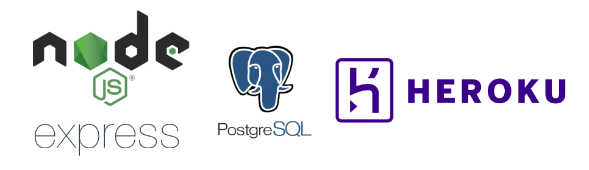

[](https://github.com/mauriziomonti/baristacrats-backend-final-project.git)

# Backend for "Chews" App

This is the back-end repo for "Chews", a mobile-first web app made as part of final project month at the [School of Code](https://www.schoolofcode.co.uk/) bootcamp (August 2022) by [Simon Partridge](https://github.com/simonpartridge86), [Adam Phasey](https://github.com/AdamPhasey), [Sam Wylie](https://github.com/samsonhumber), [Maurizio Monti](https://github.com/mauriziomonti), [Kunal Shukla](https://github.com/kun-shukla) and [Mino Devito](https://github.com/MagicMino).

For details about the project front-end and app design, please see the corresponding [front-end repo here](https://github.com/simonpartridge86/baristacrats-frontend-final-project).

---

## Index

- [Description](#description)
- [Back-End Tools](#back-end-tools)
- [API Reference](#api-reference)
- [Run Locally](#run-locally)
- [Database Setup](#database-setup)
- [Support and Feedback](#support-and-feedback)

---

## Description

This repo contains details of the server and database created for Chews app, including API routes, PostgreSQL queries, and tests. Our API routes are connected to a Heroku database and requested data is sent to the frond-end via various GET routes. Each GET route is distilled by our server into a single fetch request to an external API, [TheMealDB API](https://www.themealdb.com/api.php), to obtain recipe data.

The backend can be tested in deployment [here](https://chews-backend.herokuapp.com/).

---

## Back-End Tools



We chose to construct our back-end using technologies learned during the School of Code bootcamp, namely Node.js, Express, PostgreSQL, and Heroku. This helped to consolidate our learning from the bootcamp process.

Heroku was used for both database hosting and back-end deployment.

---

## API Reference

**_Get ingredients_**

Fetches related ingredients from database based on partial ingredient name input.

```http
  GET ~/ingredients-list/:id
```

| Parameter | Type     | Description                                          |
| :-------- | :------- | :--------------------------------------------------- |
| `id`      | `string` | **Required**: id (partial ingredient name as string) |

**_Get random meal_**

Fetches a random meal based on meal-type input (breakfast, main, or dessert).

```http
  GET ~/random-meal
```

| Parameter | Type    | Description                                       |
| :-------- | :------ | :------------------------------------------------ |
| `meal`    | `query` | **Required**: meal query (e.g. "?meal=breakfast") |

**_Get meal by ingredients_**

Fetches a random meal based on meal-type (breakfast, main, or dessert) and ingredients inputs.

```http
  GET ~/ingredients-category
```

| Parameter     | Type    | Description                                                          |
| :------------ | :------ | :------------------------------------------------------------------- |
| `category`    | `query` | **Required**: category query (e.g. "?category=breakfast")            |
| `ingredients` | `query` | **Required**: ingredients query (e.g. "?ingredients=chicken,garlic") |

**_Get meal by area and/or category_**

Fetches a random meal based on cuisine area (e.g. "Italian") and/or diet category (e.g. "Vegetarian").

```http
  GET ~/area-category
```

| Parameter  | Type    | Description                                           |
| :--------- | :------ | :---------------------------------------------------- |
| `area`     | `query` | **Required**: area query (e.g. "?area=Italian")       |
| `category` | `query` | **Required**: category query (e.g. "?category=Vegan") |

---

## Run Locally

To install and run this backend locally, please follow these steps:

Clone the project:

```bash
git clone https://github.com/AdamPhasey/baristacrats-backend-repo.git
```

Install dependencies and start the server:

```bash
npm install
npm run dev
```

The server is setup to run locally on localhost:3000.

---

## Database Setup

Create a ".env" file and add the required environment variables:

```
  MEALDB_URL: <URL for TheMealDB API>
  PG_URL: <database connection URL>
```

_NB. The following test URL can be used to access TheMealDB API for free (paid keys are also available):_

```http
"www.themealdb.com/api/json/v1/1"
```

Next, run the following scripts to create, populate, or drop the required tables on your own database:

**_Ingredients Table_**

Stores ingredients from TheMealDB API and their corresponding meal IDs.

```bash
  npm run createIng
  npm run populateIng
  npm run dropIng
```

**_Categories Table_**

Stores meal categories from TheMealDB API and their corresponding meal IDs.

```bash
  npm run createCat
  npm run populateCat
  npm run dropCat
```

**_Areas Table_**

Stores cuisine areas from TheMealDB API and their corresponding meal IDs.

```bash
  npm run createArea
  npm run populateArea
  npm run dropArea
```

---

## Support and Feedback

To receive support or give feedback, please contact team members through the details provided on their Github profiles:

[@Simon Partridge](https://github.com/simonpartridge86)

[@Adam Phasey](https://github.com/AdamPhasey)

[@Sam Wylie](https://github.com/samsonhumber)

[@Maurizio Monti](https://github.com/mauriziomonti)

[@Kunal Shukla](https://github.com/kun-shukla)

[@Mino Devito](https://github.com/MagicMino)

<br>

[--Return to Index](#index)
